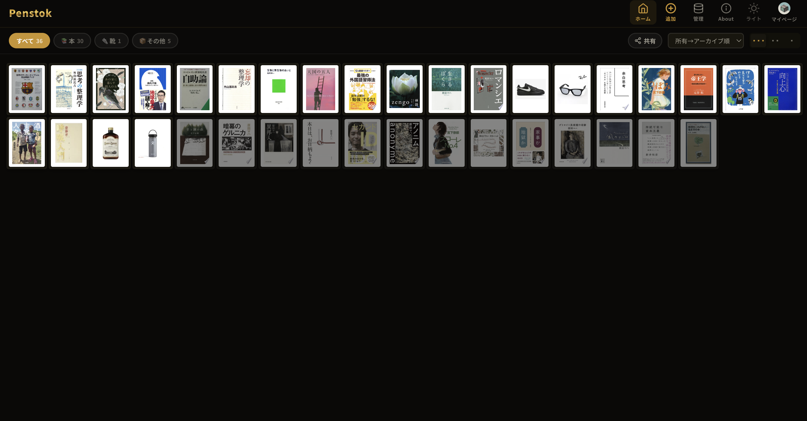

# Penstok

所有物を記録し、「手放し方」まで含めて管理するWebアプリです。

モノの購入後に発生する「どう処分するか分からない」「面倒で放置する」といった課題を解決することを目的としています。

**手放す、を設計する。**

## スクリーンショット

棚画面（所有物一覧）



## 主な機能

- **棚管理**: カテゴリ別にアイテムを登録・検索・一覧表示
- **手放し記録**: 再販売 / 譲渡 / 寄付 / リサイクル / 廃棄 の5種類を記録
- **手放しアシスト**: フリマ・買取サービスへのリンク、廃棄情報、Penstokユーザーの手放し傾向を表示
- **所有分布マップ**: 同じ商品の所有者が日本のどこにいるかを地図で可視化
- **Penstokスコア**: 活動量・継続性・循環貢献・データ貢献の4軸でスコアリング
- **商品データベース**: バーコードスキャン・外部API（Google Books / 楽天）による自動登録
- **カスタム画像**: 撮影・白背景合成・背景除去に対応

## 技術スタック

| 領域 | 技術 |
|---|---|
| フレームワーク | Vue 3 (Composition API) + TypeScript |
| ビルド | Vite |
| バックエンド | Firebase (Authentication / Firestore / Hosting) |
| 画像ストレージ | Cloudinary |
| 地図 | Leaflet |
| バーコード | @zxing/browser |
| 背景除去 | @imgly/background-removal |

## コンセプト

Penstokは「モノの所有から手放しまで」を一つの流れとして捉え、
そのデータを蓄積・可視化することを目的としています。

データを「使える形に整える」ことに興味があり、
その思想をプロダクトとして実装しています。

## セットアップ

### 1. 依存関係のインストール

```bash
npm install
```

### 2. 環境変数の設定

`.env.local` を作成して以下を設定する。

```env
# Firebase
VITE_FIREBASE_API_KEY=
VITE_FIREBASE_AUTH_DOMAIN=
VITE_FIREBASE_PROJECT_ID=
VITE_FIREBASE_STORAGE_BUCKET=
VITE_FIREBASE_MESSAGING_SENDER_ID=
VITE_FIREBASE_APP_ID=

# Cloudinary
VITE_CLOUDINARY_CLOUD_NAME=
VITE_CLOUDINARY_UPLOAD_PRESET=

# 外部API（任意）
VITE_RAKUTEN_APP_ID=
```

### 3. Firebase の設定

1. [Firebase Console](https://console.firebase.google.com) でプロジェクトを作成
2. Authentication で **Google** ログインを有効化
3. Firestore Database を作成しセキュリティルールを設定
4. Firebase CLI でプロジェクトをリンク

```bash
firebase login
firebase use <project-id>
```

### 4. 開発サーバーの起動

```bash
npm run dev
```

### 5. デプロイ

```bash
npm run build
firebase deploy --only hosting
```

## ディレクトリ構成

```
src/
├── components/
│   ├── AccountModal.vue      # マイページ・スコア表示
│   ├── BarcodeScanner.vue    # バーコードスキャナー
│   ├── DisposalAssist.vue    # 手放しアシスト
│   ├── GlobalToolbar.vue     # グローバルナビ
│   ├── OwnershipMap.vue      # 所有分布マップ
│   ├── PhotoUpload.vue       # 画像撮影・白背景合成・背景除去
│   └── ShelfCard.vue         # 棚カード
├── lib/
│   ├── firebase.ts           # Firebase 初期化
│   └── auth.ts               # 認証ユーティリティ
├── router/                   # Vue Router 設定
├── store/
│   ├── shelf.ts              # 棚アイテム管理
│   ├── products.ts           # 商品DBキャッシュ
│   └── userProfile.ts        # ユーザープロフィール
├── types/
│   └── index.ts              # 型定義
├── views/
│   ├── ShelfView.vue         # 棚一覧
│   ├── AddItemView.vue       # アイテム追加
│   ├── ItemDetailView.vue    # アイテム詳細・手放し
│   ├── LoginView.vue         # ログイン
│   ├── AboutView.vue         # サービス紹介
│   └── admin/               # 管理画面
└── App.vue                   # ルートコンポーネント・テーマ管理
```

## ライセンス

Private
